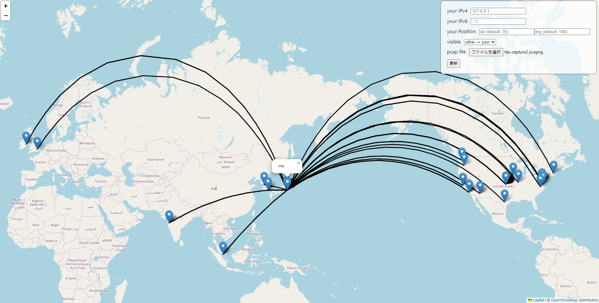
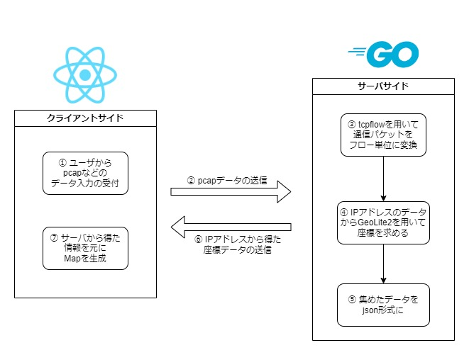

# NetworkVizMap
アプリ名：「NetworkVizMap」

Map APIを用いてネットワークの通信を可視化するシステム

pcapをファイルを元に自分が通信したサーバがどこにあるのかをMapに可視化することができる。<br>
通信はtcpflowを用いてパケット単位のものをフロー単位にまとめている。また、IPアドレスから住所を求める際には、MaxMind社のGeoLite2のデータベースを用いている。Mapの描画は、OpenStreetMapを用いている。

※注意点としては、とりあえず作ってみたかったものなので、ところどころ実装が雑である。

# Demo
大学にて、10分ほどwiresharkで自分のパソコンのネットワークの通信をキャプチャしたものだが、様々な箇所のサーバに通信を行っていることが分かる。



# Implement
処理の概要としては以下のようになっている。



# Requirement
## Language
- TypeScript（クライアントサイド）
- Go（サーバサイド）

## Library
- React
- leaflet

## Other
- OpenStreetMap API
- MaxMind社 GeoLite2

# Usage
※GeoLite2のデータベースをGitHubにアップするのはどうかと思うので、クローンするだけでは基本的に動きません。

## GeoLite2のデータベースの準備
今回はGeoLite2 Cityのデータベースを用いています。<br>
データベースをダウンロードしたら```back/```配下に格納し、データベースのファイルのパスを```back/config/config.go```に記入する。

```
package config

const (
    GEOIP_DB_PATH = "./GeoLite2-City_20230127/GeoLite2-City.mmdb" ← このような形で記入

    REPORT_FILE_NAME = "report.xml"
    OUTPUT_ROOT_DIR = "tcpflow-data"

    FROMPCAP_ROOT_DIR = OUTPUT_ROOT_DIR + "/frompcap"
    FROMPCAP_UPLOAD_DIR = FROMPCAP_ROOT_DIR + "/upload"

    REALTIME_ROOT_DIR = OUTPUT_ROOT_DIR + "/realtime"
)
```

## Dockerの起動
※nodeのコンテナをdocker上で動かすと動作が重く開発に支障が出たため、```docker-compose.yml```にはnodeの設定を書いているが、コメントアウトしている。

### サーバサイドの準備
1. Dockerをインストールする

2. コンテナの作成
    ```
    $ docker-compose up -d
    ```

3. サーバの起動 まずは、pythonのコンテナに接続
    ```
    $ docker exec -it network-viz-map-go sh
    ```
4. そして、サーバを起動
    ```
    $ go run main.go
    ```

### クライアントサイドの準備
1. パッケージのインストール
    ```
    yarn install
    ```
2. ローカルサーバーの起動
    ```
    yarn start
    ```
3. ブラウザから```http://localhost:3000```にアクセス